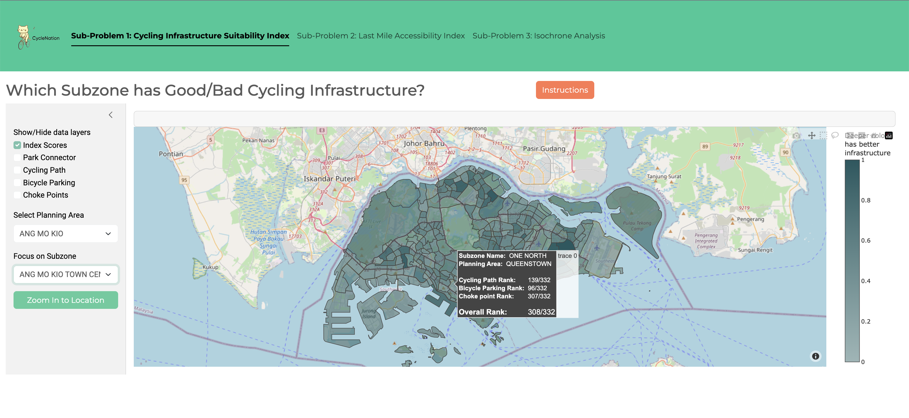

# CycleNation: Public Transportation In Singapore

Welcome to our DSE3101 project! We are The Justins, a team of eager and curious data science undergraduates.

## Project Overview

With a greater emphasis on a car-lite society, this project aims to answer the following problem statement: How can we quantify bicycle accessibility by district, and therefore identify and provide recommendations for revamping cycling infrastructure by district? The project comprises of three sub-problems to deal with the problem:

## Frontend

Our web application is run via Shiny for Python, and all visualisations are hosted with [plotly](https://dash.plotly.com/).

 Upon running Frontend/app.py in a local server, we may view the app in a web browser page.

#### **Sub-Problem 1 (SP1)**: Cycling Infrastructure Quality Index.

In creating this index, we will utilise many infrastructural factors to compute an overall ranking for each subzone. This will help to identify which areas in Singapore are lacking in cycling infrastructures.


#### **Sub-Problem 2 (SP2))**: Last-Mile Connectivity Assessment.

For this assessment, we will analyse the average distance from residential centroids to the nearest MRT stations within each district via cycling lanes and footpaths. This is to decide which areas in Singapore may benefit from the development of additional cycling lanes or improved pedestrian pathways.

#### **Sub-Problem 3 (SP3)**: Multimodal Transport Alternatives Analysis.

In this analysis, we will compare the coverage and effectiveness of alternatives such as bus routes and pedestrian paths from MRT/ LRT stations given a particular time limit.

## Backend

residential_data.ipynb

- generate residential clusters via K-means clustering

mrtstations.py

* consolidate MRT station coordinates
* We combine from data.gov.sg as well as OneMap API, in order to validate that our data is up to date

#### SP2

Pairing of MRT and Residential Clusters

* uses OneMap, ORS and OTP APIs to get data required for SP2 visualisation
* Data cleaning performed
* Pairing is performed for both n(5) pairing method and individual pairing method.
* explain routing API function here

MRT Rankings

* Here we formulated our SP2 weighted score function
* explain weighted score here (take from journal)

#### SP3

SP3_generate_isochrones.ipynb

- Here we write API calling function for OTP's Isochrone API.
- explain briefly


We iteratively call and save the following Isochrones from 10min-60min, across 5min intervals

* Cycling
* Bus + Walk
* MRT + Walk
* Public Transport + Walk

note: SP3/app.py contains our draft implementation of subproblem 3

## Data

In the gathering of raw data, there were several datasets that were drawn from various sources which will be dealt in greater depth below:

1. Cycling Path. This dataset refers to the line representation of an intra-town path designated for cyclists. However, this excludes park connectors. The file was downloaded as an .SHP file from [LTA Datamall](https://datamall.lta.gov.sg/content/datamall/en/static-data.html).
2. Park Connector Loop. Last updated in July 2023, this dataset comprises an islandwide network of linear open spaces around major residential areas - linking up parks and nature sites. This was downloaded as a .geojson file from the National[ Parks Board](https://beta.data.gov.sg/datasets/d_a69ef89737379f231d2ae93fd1c5707f/view).
3. Bicycle Parking. This refers to the points representing bicycle parking, and details of the racks such as the number of racks and if it is sheltered. The file was obtained from [LTA Datamall](https://datamall.lta.gov.sg/content/datamall/en/static-data.html). LTA provides the coordinate locations of every bicycle rack within a 5km radius of a specified set of coordinates. Therefore by querying across a grid of coordinates 5km apart, we can get coverage across Singapore, finding all locations of racks and then dropping the duplicates. Shapely points were obtained from the latitude and longitude coordinate data in the file.
4. Subzone Census. Last updated in March 2024, the data here shows the indicative polygon for the planning area boundary. This was done to facilitate urban planning through the division of Singapore into regions, planning areas and subzones, by the Urban Redevelopment Authority (URA). The data was obtained as a .geojson file from [Urban Redevelopment Agency](https://beta.data.gov.sg/collections/1749/datasets/d_8594ae9ff96d0c708bc2af633048edfb/view).
5. Cycling Choke Points. Last updated in March 2024, this shows the points representing the potential choke points or hazards for cyclists. This was downloaded as a .KML file from [pcncyclingsingapore](https://pcncyclingsingapore.wordpress.com/).
6. MRT Stations. This was obtained from a combination of multiple use of OneMap and [LTA Datamall](https://datamall.lta.gov.sg/content/datamall/en/static-data.html). Obtaining the names of all MRT and LRT stations, the exact coordinates of this station was obtained from OneMap by running the names of these stations into the API call through the use of a for-loop. The dataset was then constructed through the binding of columns of the names of the MRT/ LRT stations and their corresponding latitude and longitude coordinates. In preparation for analysis, the removal of stations that are built but not functioning was done as well. This includes stations such as Mount Pleasant Station and Marina South Station.
7. Private and Public housing coordinates from [data.gov](https://data.gov.sg/). Coordinate data of all HDB blocks (12847 rows) as well as private property locations (82667 rows) are obtained directly as .csv.
8. Resident Population. Last updated in June 2021, the data shows the total number of resident population in each subzone (URA Master Plan 2019) and their breakdown by age and sex. The data was downloaded as a .CSV file from the [Singapore Department of Statistics](https://www.singstat.gov.sg/publications/reference/cop2020/cop2020-sr1).


## Set Up

#### Requirements

- Python libraries
  - Can be found in requirements.txt
- API Access Tokens
  - OneMap and OpenRouteService APIs used both required API keys, which are stored in a .env in the parent directory.

#### OTP

- https://docs.opentripplanner.org/en/v2.5.0/Basic-Tutorial/
- Step 1: We obtained regional OpenStreetMap (OSM) data from [Geofabrik](http://www.geofabrik.de/), and isolated the coordinates for Singapore’s land area using Osmium saving as a .pbf file. Gathering of the General Transit Feed Specification (GTFS) from LTA and Singapore’s OSM were done.
- Step 2: After gathering of the data, the preparation and deployment of the OTP server is done. This is where GTFS and OSM layers are used to build a multimodal graph representing Singapore’s transportation network. We can then run the server locally to provide trip planning and other API services. The graph will also be saved into the directory.
- Step 3: Building, loading and saving the graph, as well as layering of GTFS onto OSM is done through the following lines on the terminal:
  - ```
    java -Xmx10G -jar otp-2.5.0-shaded.jar --buildStreet .
    java -Xmx10G -jar otp-2.5.0-shaded.jar --loadStreet --save .
    java -Xmx6G -jar otp-2.5.0-shaded.jar --load .
    ```

* Whenever needed, OTP is run on a local server via the following terminal command:
  * ```
    java -Xmx6G -jar otp-2.5.0-shaded.jar --load /enter/your/repository/here/Public-Transportation-In-Singapore/Backend/otp/  --serve
    ```

## Acknowledgements

We credit the following data sources and API services for providing the resources required for our project:

- API:
  - [OneMap](https://www.onemap.gov.sg/apidocs/apidocs/)
  - [LTA DataMall](https://datamall.lta.gov.sg/content/datamall/en/dynamic-data.html)
  - [OpenRouteService](https://openrouteservice.org/dev/#/api-docs/)
  - [OpenTripPlanner](https://docs.opentripplanner.org/en/v2.5.0/)
- Downloaded from Web:
  - Residential, MRT station coordinates: [data.gov](https://data.gov.sg/)
  - Resident Population: [Singapore Department of Statistics](https://www.singstat.gov.sg/publications/reference/cop2020/cop2020-sr1)
  - Open Street Map data: [GeoFabrik](https://download.geofabrik.de/asia/malaysia-singapore-brunei.html)
  - LTA's General Transit Feed Specification (GTFS): [Transitland](https://www.transit.land/feeds/f-w21z-lta)
  - Cycling Choke points: [pcncyclingsingapore](https://pcncyclingsingapore.wordpress.com/)
  - PCN: [National Parks Board](https://beta.data.gov.sg/datasets/d_a69ef89737379f231d2ae93fd1c5707f/view)

Additionally, we would like to acknowlege our professors, Prof Huang and Prof Denis, for their guidance over the duration of developing this project. Thank you!
