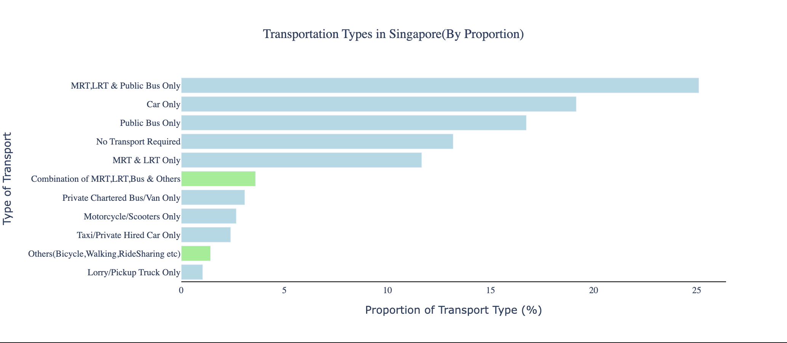
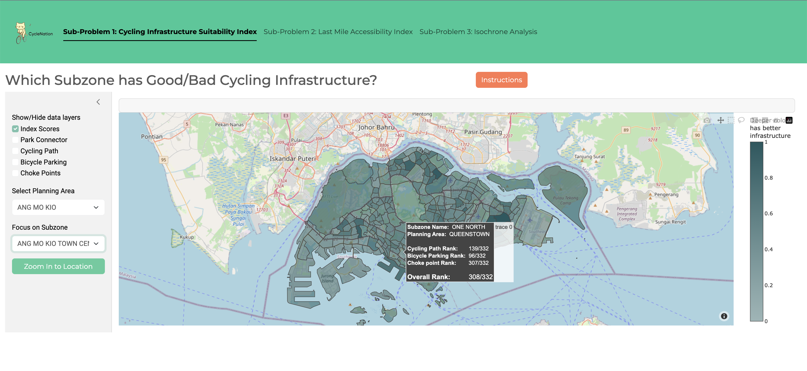
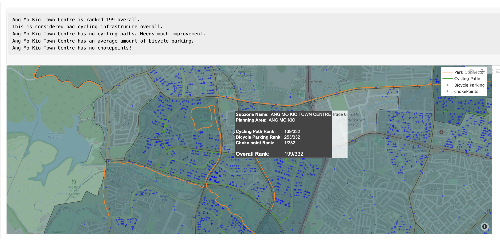
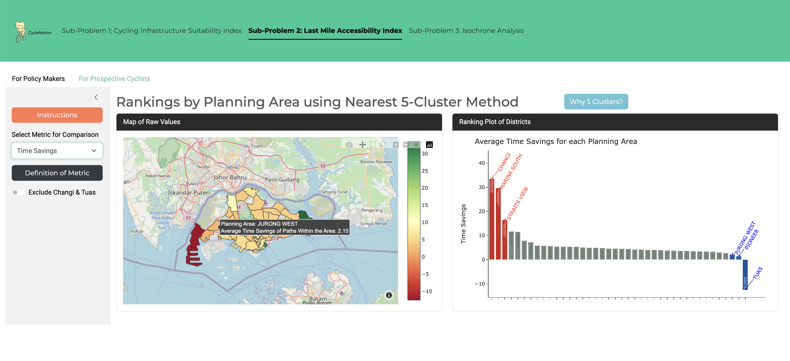
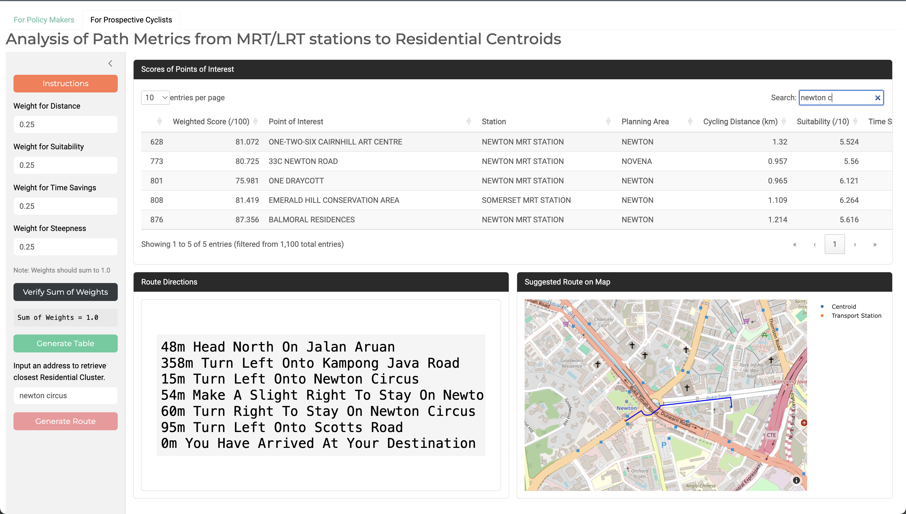
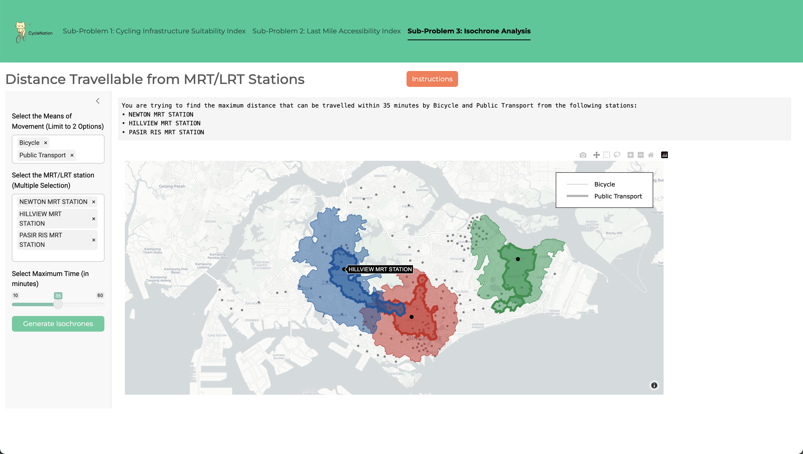

# CycleNation: Public Transportation In Singapore

Welcome to our DSE3101 project! We are The Justins, a team of eager and curious data science undergraduates at NUS.

## Project Overview

#### Exploratory Data Analysis



Green bars denote usage of bicycles for transport in Singapore, whether to work or school. We can see that there is a low usage of bicycles for transport. Yet there is a high usage of MRT, which we believe presents us a use-case for cycling, as a last-leg transport mode from MRT stations to residential areas.

#### Problem Statement

With a greater emphasis on a car-lite society, this project aims to answer the following problem statement: How can we quantify bicycle accessibility by district, and therefore identify and provide recommendations for revamping cycling infrastructure by district? The project comprises of three sub-problems to deal with the problem:

* Cycling Infrastructure Quality Index.
* Last-Mile Connectivity Assessment.
* Multimodal Transport Alternatives Analysis.

These are explained in detail in the following section.

## Frontend

Our web application is run via Shiny for Python, and all visualisations are hosted with [plotly](https://dash.plotly.com/).

 Upon running Frontend/app.py in a local server, we may view the app in a web browser page.

### **Sub-Problem 1 (SP1)**: Cycling Infrastructure Quality Index.



In creating this index, we will utilise different infrastructural factors to compute an overall ranking for each subzone. This will help to identify which areas in Singapore are lacking in cycling infrastructures. We used the total length of bicycle lanes (inclusive of both cycling lanes and regional park connectors) and number of bicycle parking as features in the computation of the index. We also included more features, such as the presence of hazards along dedicated bicycle lanes, such as traffic lights, steps and overpasses, etc.



In the above figure, after users zoom into their subzone of interest, the textbox above the map will update, guiding users on the interpretation. A few conditions were used in the computation of this message.

1. All four types of Scores (Cycling Lanes, Bicycle Parking, Choke Point, Overall) are considered good if they are better than the upper quartile. It is considered bad if it is worse than the lower quartile. Otherwise, it will be considered average.
2. Since there are many subzones with no cycling paths at all, a Total Cycling Path Rank of 139 means that there are no cycling paths at all. Similarly, subzones with a Choke Point Ranking of 1 means that there are no choke points present.

### **Sub-Problem 2 (SP2)**: Last-Mile Connectivity Assessment.

Last mile connectivity, defined as the ease of completing the last leg of a journey from a transport hub to a final destination, is an important consideration for the users in choosing between different modes of transport and for the government who is providing and creating policies around it. For this assessment, we will analyse the average distance from residential centroids to the nearest MRT stations within each planning area via cycling lanes and footpaths. This is to decide which areas in Singapore may benefit from the development of additional cycling lanes or improved pedestrian pathways.

###### For Policy Makers:



The choropleth Map provides a high level snapshot of cycling accessibility across Singapore's planning areas by using a devised nearest 5 cluster method. Users may select from the following available metrics: Time Savings, Route Distance, Suitability (of path for cycling), and a Weighted Score  derived from the previously mentioned metrics. These metrics are explained in further detail in Backend.

Users will also be able to view the rankings of each planning area, for the specified metric, on the right plot.

###### For Prospective Cyclists:



Taking the perspective of prospective cyclist, we might want to visualise how individual cycling routes from a residential cluster to its closest MRT station performs. The detailed datatable allows users to search and compare clusters and/or MRT stations by the previously mentioned metrics. 

Additionally, we implement functionality to allow users to speficy the weights of our weighted score formula and the table will update the weighted scores. One can filter and sort based on the given columns to assess which are the best/worst paths.

Lastly, users may retrieve and visualise the actual route and directions for their closest residential cluster. 


### **Sub-Problem 3 (SP3)**: Multimodal Transport Alternatives Analysis.

In this analysis, we will compare the coverage and effectiveness of alternatives such as bus routes and pedestrian paths from MRT/ LRT stations given a particular time limit, using isochrone maps.



Through the specification of the transport modes, MRT/LRT stations, and time limit, colours of the various MRT/LRT stations have been tagged by their respective MRT/LRT line colours to allow users to better identify the stations as well. This visualisation is expected to aid LTA in the decision of the coverage of the MRT/LRT stations. With more MRT/LRT stations having their isochrone plots overlapping with one another, this simply means that residents staying within overlapping regions have a greater accessibility in general as they have access to greater numbers of MRT/LRT stations in the specified time limit.

## Backend

##### Pre-processing

Data pre-processing is performed in the following files, to prepare the coordinate data for MRT stations  as well as residential clusters.

- residential_data.ipynb
  - In order to find meaningful representations of residential areas, we performed K-means clustering of private residential areas and HDB blocks, to obtain 10 clusters each, for a total of 1100 clusters across 55 planning areas.

    
  - The total number of clusters was arbitrarily modified until it satisfactorily encapsulated the distribution of residential areas across Singapore.
- mrtstations.py
  - We consolidate MRT station coordinates from data.gov.sg as well as OneMap API, in order to get the most up-to-date locations of MRT stations.

#### SP1

* Explain how index is computed

<u>Generation of Final Score</u>
* Tagging of importance by weights
* The following formula shows the computation of the overall score of each subzone

Final Score = Weighted Score / log<sub>e</sub>Area<sup>Subzone</sup> / log<sub>e</sub>Pop<sup>Subzone</sup>

Weighted Score = w<sub>1</sub> · S<sup>Lanes</sup> + w<sub>2</sub> · S<sup>Parking</sup> + \sum_{c=0}^{10} w<sub>c</sub> · S<sup>Choke</sup>

Where Area<sup>Subzone</sup> is the area of the subzone, Pop<sup>Subzone</sup> is the resident population in the subzone, S<sup>Lanes</sup> is the score calculated from the total length of cycling lanes, S<sup>Parking</sup> is the score calculated from the number of bicycle parking, S<sup>Choke</sup> is the score calculated from the number of choke points present and <var>c</var> denotes the type of choke point present, <var>w</var> is the weight associated with the corresponding score. All scores are calculated within subzones. 

For our project, we decided to fix the weights for each factor in order to form an objective comparison, where w<sub>1</sub> = 4, w<sub>2</sub> = 3, while w<sub>c</sub> = -0.5 if the chokepoint has bicycle-friendly cycling features, and w<sub>c</sub> = -1 if it does not. In future works, we intend to leave the setting of these weights for users to input so as to cater to their personal preferences.

Next, the normalisation by the population size and area of the subzone was done to consider the inconvenience of cycling in areas with more people, and larger subzones where cycling paths tend to be more sparse. 

#### SP2

Pairing of MRT and Residential Clusters

* Uses OneMap, ORS and OTP APIs to get data required for SP2 visualisation
* Data cleaning performed
* Pairing is performed for both n(5) pairing method and individual pairing method.
* Explain two pairing methods
* Explain routing API function here

MRT Rankings

* Here we formulated our SP2 weighted score function
<u>Computation of Final Score</u>

Weighted Score = w<sub>1</sub> · (T<sub>i</sub><sup>Cycling</sup> - T<sub>i</sub><sup>Bus</sup>) + w<sub>2</sub> · D<sub>i</sub> + w<sub>3</sub> · S<sub>i</sub><sup>Suitability</sup> + w<sub>4</sub> · S<sub>i</sub><sup>Steepness</sup>

Where T<sub>i</sub><sup>Cycling</sup> is the time taken by cycling, T<sub>i</sub><sup>Bus</sup> is the time taken by public transport (bus and walking), (T<sub>i</sub><sup>Cycling</sup> - T<sub>i</sub><sup>Bus</sup>) represents the time savings of taking the bus rather than cycling, D<sub>i</sub> shows the actual distance of path to cycle, S<sub>i</sub><sup>Suitability</sup> is the suitability score, S<sub>i</sub><sup>Steepness</sup> is the steepness score, <var>w</var> is the weight associated with the corresponding score.

Without transforming the data, taking the absolute value would result in the component time savings dominating the score regardless of its assigned weights due to its large range. Each component of the weighted score is thus standardized to standard normal, before passing to the weighted score function. Standardizing the components to a standard normal distribution helps to equalize the impact of each component on the final score calculation. This ensures that each component contributes proportionally to the final score based on its weight, rather than its scale or range. The score is then normalized to the final score to take a range between 0-100. This ensures that the score is easily interpretable and comparable across different scenarios.

#### SP3

SP3_generate_isochrones.ipynb

- Here we write API calling function for OTP's Isochrone API.
- explain briefly

We iteratively call and save the following Isochrones from 10min-60min, across 5min intervals

* Cycling
* Bus + Walk
* MRT + Walk
* Public Transport + Walk

note: SP3/app.py contains our draft implementation of subproblem 3

## Data

In the gathering of raw data, there were several datasets that were drawn from various sources which will be dealt in greater depth below:

1. Cycling Path. This dataset refers to the line representation of an intra-town path designated for cyclists. However, this excludes park connectors. The file was downloaded as an .SHP file from [LTA Datamall](https://datamall.lta.gov.sg/content/datamall/en/static-data.html).
2. Park Connector Loop. Last updated in July 2023, this dataset comprises an islandwide network of linear open spaces around major residential areas - linking up parks and nature sites. This was downloaded as a .geojson file from the National[ Parks Board](https://beta.data.gov.sg/datasets/d_a69ef89737379f231d2ae93fd1c5707f/view).
3. Bicycle Parking. This refers to the points representing bicycle parking, and details of the racks such as the number of racks and if it is sheltered. The file was obtained from [LTA Datamall](https://datamall.lta.gov.sg/content/datamall/en/static-data.html). LTA provides the coordinate locations of every bicycle rack within a 5km radius of a specified set of coordinates. Therefore by querying across a grid of coordinates 5km apart, we can get coverage across Singapore, finding all locations of racks and then dropping the duplicates. Shapely points were obtained from the latitude and longitude coordinate data in the file.
4. Subzone Census. Last updated in March 2024, the data here shows the indicative polygon for the planning area boundary. This was done to facilitate urban planning through the division of Singapore into regions, planning areas and subzones, by the Urban Redevelopment Authority (URA). The data was obtained as a .geojson file from [Urban Redevelopment Agency](https://beta.data.gov.sg/collections/1749/datasets/d_8594ae9ff96d0c708bc2af633048edfb/view).
5. Cycling Choke Points. Last updated in March 2024, this shows the points representing the potential choke points or hazards for cyclists. This was downloaded as a .KML file from [pcncyclingsingapore](https://pcncyclingsingapore.wordpress.com/).
6. MRT Stations. This was obtained from a combination of multiple use of OneMap and [LTA Datamall](https://datamall.lta.gov.sg/content/datamall/en/static-data.html). Obtaining the names of all MRT and LRT stations, the exact coordinates of this station was obtained from OneMap by running the names of these stations into the API call through the use of a for-loop. The dataset was then constructed through the binding of columns of the names of the MRT/ LRT stations and their corresponding latitude and longitude coordinates. In preparation for analysis, the removal of stations that are built but not functioning was done as well. This includes stations such as Mount Pleasant Station and Marina South Station.
7. Private and Public housing coordinates from [data.gov](https://data.gov.sg/). Coordinate data of all HDB blocks (12847 rows) as well as private property locations (82667 rows) are obtained directly as .csv.
8. Resident Population. Last updated in June 2021, the data shows the total number of resident population in each subzone (URA Master Plan 2019) and their breakdown by age and sex. The data was downloaded as a .csv file from the [Singapore Department of Statistics](https://www.singstat.gov.sg/publications/reference/cop2020/cop2020-sr1).

## Set Up

#### Requirements

- Python libraries
  - Can be found in requirements.txt
  - ```
    pip install -r requirements.txt

    ```
- API Access Tokens
  - OneMap and OpenRouteService APIs used both required API keys, which are stored in a .env in the parent directory.

#### OTP

- https://docs.opentripplanner.org/en/v2.5.0/Basic-Tutorial/
- Step 1: We obtained regional OpenStreetMap (OSM) data from [Geofabrik](http://www.geofabrik.de/), and isolated the coordinates for Singapore’s land area using Osmium saving as a .pbf file. Gathering of the General Transit Feed Specification (GTFS) from LTA and Singapore’s OSM were done.
- Step 2: After gathering of the data, the preparation and deployment of the OTP server is done. This is where GTFS and OSM layers are used to build a multimodal graph representing Singapore’s transportation network. We can then run the server locally to provide trip planning and other API services. The graph will also be saved into the directory.
- Step 3: Building, loading and saving the graph, as well as layering of GTFS onto OSM is done through the following lines on the terminal:
  - ```
    java -Xmx10G -jar otp-2.5.0-shaded.jar --buildStreet .
    java -Xmx10G -jar otp-2.5.0-shaded.jar --loadStreet --save .
    java -Xmx6G -jar otp-2.5.0-shaded.jar --load .
    ```

* Whenever needed, OTP is run on a local server via the following terminal command:
  * ```
    java -Xmx6G -jar otp-2.5.0-shaded.jar --load /enter/your/repository/here/Public-Transportation-In-Singapore/Backend/otp/  --serve
    ```

## Acknowledgements

We credit the following data sources and API services for providing the resources required for our project:

- API:
  - [OneMap](https://www.onemap.gov.sg/apidocs/apidocs/)
  - [LTA DataMall](https://datamall.lta.gov.sg/content/datamall/en/dynamic-data.html)
  - [OpenRouteService](https://openrouteservice.org/dev/#/api-docs/)
  - [OpenTripPlanner](https://docs.opentripplanner.org/en/v2.5.0/)
- Downloaded from Web:
  - Residential, MRT station coordinates: [data.gov](https://data.gov.sg/)
  - Resident Population: [Singapore Department of Statistics](https://www.singstat.gov.sg/publications/reference/cop2020/cop2020-sr1)
  - Open Street Map data: [GeoFabrik](https://download.geofabrik.de/asia/malaysia-singapore-brunei.html)
  - LTA's General Transit Feed Specification (GTFS): [Transitland](https://www.transit.land/feeds/f-w21z-lta)
  - Cycling Choke points: [pcncyclingsingapore](https://pcncyclingsingapore.wordpress.com/)
  - PCN: [National Parks Board](https://beta.data.gov.sg/datasets/d_a69ef89737379f231d2ae93fd1c5707f/view)

Additionally, we would like to acknowlege our professors, Prof Huang Yuting and Prof Denis Tkachenko, for their guidance over the duration of developing this project. Thank you!
